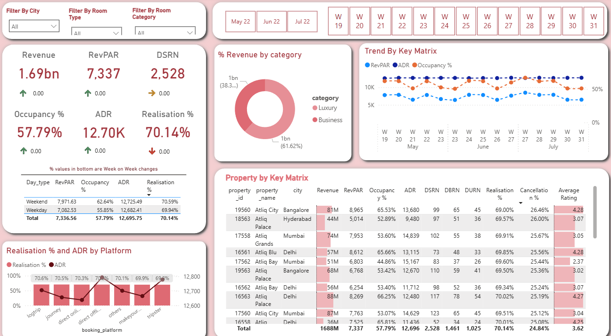

# 🏨 Hospitality Revenue Insights Dashboard

## 🖼️ Dashboard Preview

## Project Overview

This project is an end-to-end **Data Analytics** solution in the **Hospitality** domain, focusing on the development of an interactive **Power BI Dashboard**. The goal was to transform raw transactional data from a fictional hotel chain, **Atli Grans**, into actionable business intelligence to drive revenue optimization, improve service quality, and analyze pricing strategies.

This dashboard was developed by following the structured approach of a real-world project (as detailed in the Codebasics YouTube video) involving requirements gathering and stakeholder review.

## ✨ Key Business Objectives

The dashboard was specifically designed to help revenue managers and stakeholders perform rapid **Level 1** (high-level performance) and **Level 2** (diagnostic/drill-down) analysis:

1.  **Pricing Strategy Analysis:** Identify opportunities for implementing dynamic or weekday/weekend pricing strategies by monitoring the flat line of **Average Daily Rate (ADR)**.
2.  **Service Quality Correlation:** Investigate the relationship between **Average Rating** and operational metrics like **Occupancy** and **Cancellation Rates**.
3.  **Operational Efficiency:** Track **Occupancy Percentage**, **Daily Sellable Room Nights (DSRN)**, and **Realization Rate** to optimize room capacity and booking-to-stay conversion.

## 📊 Key Metrics and KPIs

The dashboard focuses on industry-standard hospitality and revenue management KPIs:

| Metric | Formula/Description |
| :--- | :--- |
| **RevPar** (Revenue Per Available Room) | Total Revenue / Total Sellable Room Nights |
| **ADR** (Average Daily Rate) | Total Revenue / Total Utilized Room Nights (URNS) |
| **Occupancy %** | Utilized Room Nights / Sellable Room Nights |
| **Realization %** | Utilized Room Nights / Booked Room Nights (URNS/BRNS) |

---

## 🛠️ Technology Stack

| Category | Tools / Technologies | Purpose |
| :--- | :--- | :--- |
| **Data Modeling/ETL** | **Power BI Desktop**, **Power Query** | Data ingestion, cleaning, transformation, and establishing a **Star Schema** relationship. |
| **Calculations/Logic** | **DAX (Data Analysis Expressions)** | Creation of all custom measures (RevPar, ADR, Occupancy, Realization) and calculated columns (e.g., Weekday/Weekend split). |
| **Automation** | **VBA Macros** | Used for automating auxiliary data preparation tasks, data extraction, or initial Excel-based report structuring. |
| **Visualization** | **Power BI** | Designing an interactive and intuitive dashboard for decision-making. |

---

## 🚀 Dashboard Features

* **Interactive Filters:** Slicers for **City**, **Room Type**, **Month**, and **Week Number** allow for granular data exploration.
* **Dynamic Trends:** Visual tooltips displaying **week-on-week trend lines** for core KPIs (RevPar, Occupancy) when hovering over the key metrics.
* **Segmented View:** Dedicated sections for **Weekday vs. Weekend** performance to identify leisure vs. business impact.
* **Diagnostic Drill-Down:** Property-level table visualization allowing users to **sort** by any metric (e.g., lowest occupancy, highest RevPar) for **Pareto Principle** analysis (identifying the bottom 20% of underperforming properties).

## 🔗 Source & Reference

This project was created as a guided challenge based on the following resource:

---

*Connect with me on [Your LinkedIn Profile Link] to discuss this project or other data analytics opportunities!*
